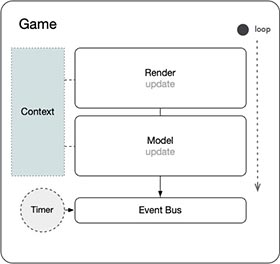

### gameloop



- In each frame, the `update` methods of both `model` and `render` are executed alternately.
- Modules can communicate and decouple through a messaging mechanism.
- A timer module is built into the message bus.
- The `model` manages game state data and logic, while the `render` mechanism is explained in detail below.

<br>

### text mode render


- The rendering process in text mode is relatively simple.
- A `Panel` contains several layers (sprite collections).
- All sprites from these layers are merged into the main buffer.
- After the double-buffering comparison, the changed content is drawn to the terminal using `crossterm`.

```
// Panel struct...
pub struct Panel {
    // double buffers...
    pub buffers: [Buffer; 2],
    pub current: usize,
    pub layers: Vec<Sprites>,
    // layer name, layer index...
    pub layer_tag_index: HashMap<String, usize>,
    // layer index, render weight...
    pub render_index: Vec<(usize, i32)>,
}

// Sprites struct...
pub struct Sprites {
    pub name: String,
    pub is_pixel: bool,
    pub is_hidden: bool,
    pub sprites: Vec<Sprite>,
    // sprite name : sprite index
    pub tag_index: HashMap<String, usize>,
    // sprite index : render weight...
    pub render_index: Vec<(usize, i32)>,
    // render weight as layers in panel...
    pub render_weight: i32,
}

// Sprite struct...
pub struct Sprite {
    pub content: Buffer,
    pub angle: f64,
    pub alpha: u8,
    // asset request record for async asset loading...
    pub asset_request: Option<(AssetType, String, usize, u16, u16)>,
    // render weight in layer(sprites)
    render_weight: i32,
}

// Buffer struct...
pub struct Buffer {
    pub area: Rect,
    pub content: Vec<Cell>,
}

// Cell struct...
pub struct Cell {
    pub symbol: String,
    pub fg: Color,
    pub bg: Color,
    pub modifier: Modifier,
    // tex id in graphics mode...
    pub tex: u8,
}
```

<br>

### graphical mode render pass 1


- In graphical mode, rendering supports Pixel Layers in addition to regular sprite collections.
- Pixel Layers manage Pixel Sprites, which differ from regular sprites by being able to move at the pixel level.
- In graphical mode, regular sprites are also merged into the main buffer and can be used to display background elements.
- Pixel Sprites are rendered separately and support transparency.
- Each Pixel Sprite's buffer, along with the main buffer, is appended to the `RenderBuffer`.
- Each element of the `RenderBuffer` is a `RenderCell`.

<br>

### graphical mode render pass 2


- In graphical mode, rendering supports Pixel Layers in addition to regular sprite collections.
- Pixel Layers manage Pixel Sprites, which differ from regular sprites by being able to move at the pixel level.

<br>

